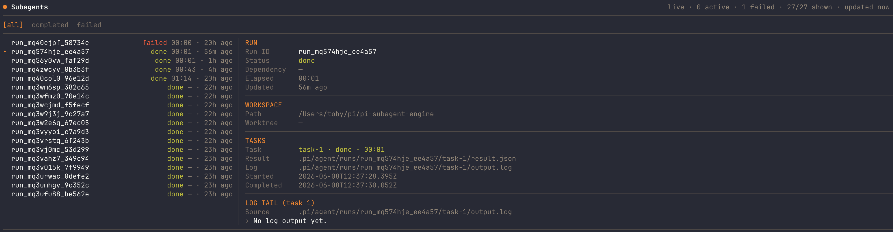

# pi-subagent

**Minimal subagent runtime for Pi.**

[](https://www.npmjs.com/package/@agwab/pi-subagent)

`pi-subagent` adds one focused tool: `subagent`. It gives Pi the essentials for isolated worker runs — parallel fan-out, sandbox/worktree controls, durable artifacts, and async status.

It is intentionally small, so you can add it to a project when you need subagents and remove it when you do not.

npm package: [`@agwab/pi-subagent`](https://www.npmjs.com/package/@agwab/pi-subagent)

## Installation

```bash
pi install npm:@agwab/pi-subagent
```

Then reload Pi.

Requires Node.js `>=22.19.0` on macOS or Linux. Native Windows is not supported (POSIX process groups, tmux, and `which`-based Pi discovery); use WSL2.

For local development, add this package as a Pi extension source and reload Pi.

## Quick usage

Use it when you want Pi to spin up a separate worker instead of doing everything in the parent session:

```text
Run three reviewers in parallel for this change.
```

```text
Run this check in a sandboxed worker and report the artifact paths.
```

```text
Start a background audit and let me inspect it in /subagent panel.
```

## What it does

Tool: `subagent`

### Sandbox

Run workers in an isolated local execution boundary.

```json
{
  "sandbox": true,
  "agent": "checker",
  "task": "Run a local check and report the artifact paths."
}
```

`sandbox: true` denies all network access. Model-backed sandboxed runs must allow their provider endpoint explicitly:

```json
{
  "sandbox": { "allowedDomains": ["api.anthropic.com"] },
  "agent": "implementer",
  "task": "Make the requested local change and run the checks."
}
```

### Worktree

Isolate parallel or mutating tasks in managed git worktrees. Workspaces default to shared; request `worktree: true` explicitly for tasks that mutate files in parallel.

```json
{
  "worktree": true,
  "agent": "implementer",
  "task": "Make the requested local change in an isolated worktree."
}
```

### Agent

Inject Pi subagent markdown definitions from global or project agent directories.

```json
{
  "agent": "reviewer-security",
  "task": "Review the current diff for security risks."
}
```

Agent markdown can live in `~/.pi/agent/agents/*.md` or `.pi/agents/*.md`. Agent-level `tools` declarations are an authority ceiling; call-level `tools` can narrow them but not expand them. A `systemPrompt` override replaces the agent prompt body, not the agent's frontmatter policy.

### Type

Use one structured schema for single, parallel, async, and existing-run calls. `action` defaults to `run`. Each execution is a run; each launch is an attempt.

Single:

```json
{
  "agent": "reviewer",
  "task": "Review the current diff and summarize the highest-risk issues."
}
```

Parallel launches independent runs concurrently:

```json
{
  "tasks": [
    { "agent": "reviewer-security", "task": "Review the current diff for security risks." },
    { "agent": "reviewer-performance", "task": "Review the current diff for performance risks." },
    { "agent": "reviewer-test-coverage", "task": "Review the current diff for missing tests." }
  ]
}
```

Existing run:

```json
{ "action": "status", "runId": "run_..." }
```

Recent runs can be addressed by `runId` even when they were launched from another cwd; legacy records still resolve from the explicit or current cwd.

### Panel

Inspect runs, attempts, artifacts, and log tails in a live TUI. The panel defaults to the current Pi session, can switch to current cwd or all indexed runs, and includes status filters plus a scrollable detail pane. It counts stale/malformed run pointers without exposing raw session ids.

Open the run monitor:

```text
/subagent panel
```



## Code API

Orchestrators can use the same runtime directly:

```ts
import { runSubagent, getSubagentStatus } from "@agwab/pi-subagent/api";

const run = await runSubagent({ agent: "reviewer", task: "Review this diff.", async: true });
const status = await getSubagentStatus({ runId: run.runId });
```

## Detailed docs

- [`docs/usage.md`](./docs/usage.md) — full argument reference, code API, `action` behavior, backend selection, sandbox/worktree behavior, artifacts, and validation notes.
